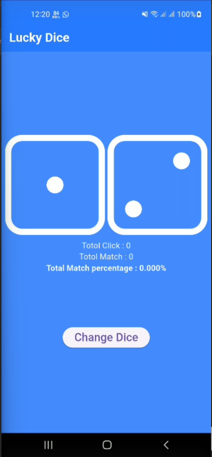
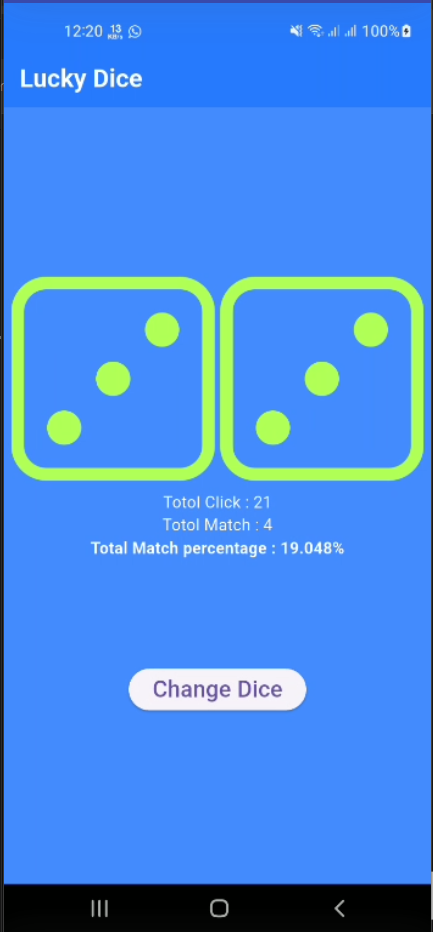

# 🎲 Lucky Dice App

A simple Flutter application that simulates rolling two dice and calculates the match percentage. This project was built **for practice purposes**, focusing on learning Flutter basics like `StatefulWidget`, random number generation, conditional UI, and simple state management.

---

## 🚀 Features

- 🎲 Roll two dice by tapping a button
- ✅ Highlights both dice in **light green** when the values match
- 🔢 Tracks:
  - Total rolls (`total_click`)
  - Number of matches (`match_dice`)
  - Live **match percentage**
- ♻️ Auto-reset after **50 rolls**

---

## 🛠️ Tech Stack

- **Flutter** (Dart)
- `StatefulWidget` for UI state handling
- `dart:math` for random number generation
- Assets used for dice images (`dice1.png` to `dice6.png`)

---

## 🔧 How to Run

1. Ensure you have Flutter installed and configured.
2. Place your dice images (`dice1.png` to `dice6.png`) in the `/assets` folder.
3. Update your `pubspec.yaml`:

```yaml
flutter:
  assets:
    - assets/
```
4. Run the app: flutter run

## 📊 Example Output
```yaml
Total Click: 25
Total Match: 5
Match Percentage: 20.000%

## 📸 App Screenshot

Here's how the Lucky Dice app looks in action:



